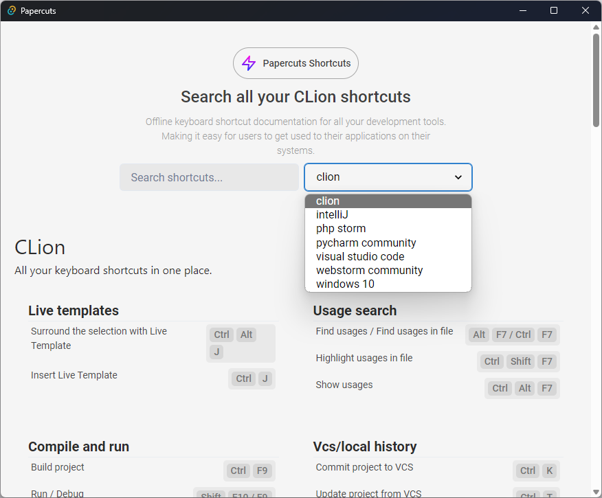

# 🧑‍🚀 Papercuts

Papercuts is a [Zeal](https://zealdocs.org/) inspired offline app that will let you browse and search all of your application shortcuts right there on your desktop. It's made especially for quicksearching all your shortcuts in Windows.

  

## Description

Papercuts is a Windows-based shortcut browser that aims to revolutionize the way you interact with keyboard shortcuts. With a growing collection of 10+ programs, Papercuts offers a comprehensive platform for discovering, organizing, and mastering shortcuts across various applications. Our mission is to simplify your workflow and boost productivity by providing a centralized hub for all your favorite keyboard shortcuts.

### 🎁 Features

- **Lightning-fast Search:** Quickly find any shortcut with our intuitive search feature.
- **Sleek User Interface:** Navigate through shortcuts effortlessly with our modern and user-friendly interface.
- **Seamless Integration:** Enjoy seamless integration with Windows for a smooth user experience.
- **Comprehensive Collection:** Access a growing collection of keyboard shortcuts from a variety of applications.
- **Customizable Experience:** Personalize your shortcut browsing experience to suit your preferences.
- **Cross-Platform Compatibility:** Coming soon! Stay tuned for cross-platform support to access Papercuts on different devices.

### 🛠️ Built with

- **Tauri:** A framework for building lightweight, cross-platform desktop apps with web technologies.
- **React:** A JavaScript library for building user interfaces.

### 👏 Acknowledgements

Thanks to all who helped inspire this software. Special thanks to the open-source community for their contributions.
This software is inspired by:

- [Zeal is an offline documentation browser for software developers](https://zealdocs.org/)

### 🗺️ Roadmap

- [x] First UI Implementation
- [ ] Open the shortcuts app via a shortcut
- [ ] Make the app available from the system tray
- [ ] Improve UI design and user experience
- [ ] Add support for custom shortcut collections
- [ ] Implement cloud storage integration for synchronization across devices
- [ ] Enhance search functionality with advanced filters and sorting options
- [ ] Integrate interactive tutorials for beginners to learn shortcut usage
- [ ] Expand shortcut coverage to include popular productivity tools and software
- [ ] Offer a dark mode option for users who prefer a darker interface
- [ ] Implement a "Quick Tips" feature for bite-sized shortcut insights
- [ ] Launch a newsletter or blog series featuring weekly shortcut highlights and productivity tips

Feel free to share your ideas and suggestions for additional features! We're committed to making Papercuts the ultimate shortcut companion for Windows users.
